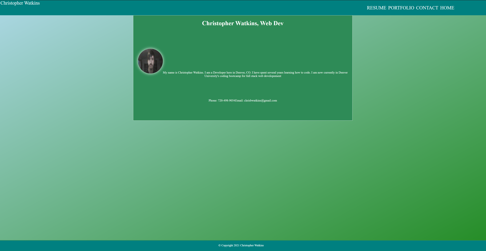

 
  # React Portfolio
   My portfolio updated to run with Reactjs.

  ## Table of Contents
  [Installation](#installation)  
  [Usage](#usage)  
  [Contributions](#contribution)  
  [Tests](#test)  
  [License](#license)  
  [Questions](#questions)  
  

    
  ## <h2 id="installation">Installation Instructions</h2>

  npm i react react-router-dom

  ## <h2 id="usage">Usage</h2>
  I use this application to help express who I am as an individual by showcasing my work and dedication. 
  ## <h2 id="contribution">Contributions</h2>
  I wouldn't mind help improving my portfolio to really maximize my potential
  ## <h2 id="test">Test Instructions</h2>
  none
  ## <h2 id="license"> License</h2>
   
  ## <h2 id="questions"> Questions </h2>
    Any questions please contact me at
   [Github](https://github.com/Tevvels)
   or at email:chrisbwatkins@gmail.com

github https://github.com/Tevvels/reactportfolio
 
livesite https://tevvels.github.io/reactportfolio/